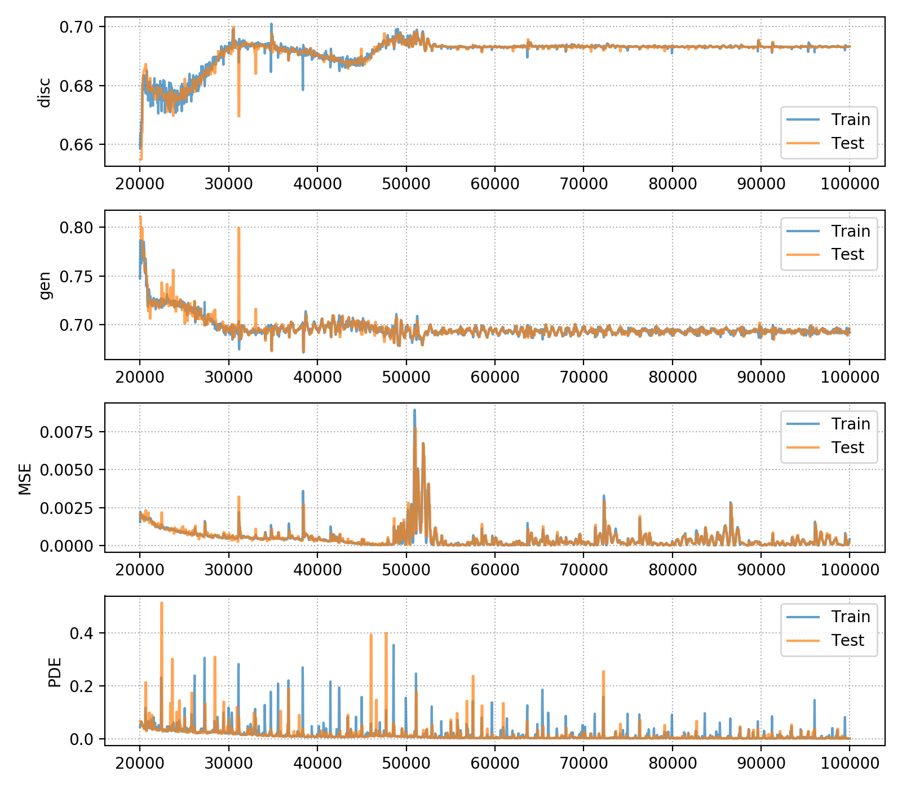
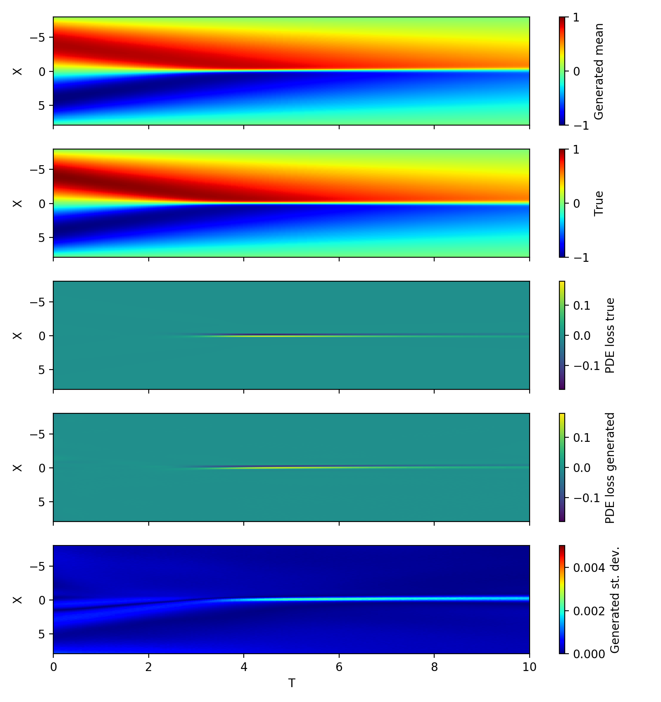

## Burgers equation PGAN demo

In this demo, we'll train a generative adversarial network (GAN) with physics-informed constraints on solutions to Burgers equation using `pgan`. Configuration for `pgan` is controlled by the file `pgan.pfg` which is a white-space delimited configuration format supported by the `pyre` package.  For this demo, the relevant sections of `pgan.pfg` are:
```
pgan:

    ; Global configuration
    global:
        inter_op_cores = 0
        intra_op_threads = 0

    ; Train generative model
    traingan:
        data_file = data.h5
        dynamics = burgers
        n_iterations = 100000
        learning_rate = 0.0002
        disc_skip = 10
        generator_layers = 50, 50, 50, 50, 1
        discriminator_layers = 50, 50, 50, 50, 1
        use_known_pde = True
        pde_beta = 10.0
```
For GAN training, the section `traingan` specifies various parameters related to neural network architectures, learning rates, penalty parameters, number of iterations, etc. Currently, we use the convention where an iteration is equal to parameter updates for one mini-batch of data. The data for the Burgers simulation have alread been packaged into a standard `pgan`-compatible HDF5 file, which we can inspect using the command:
```
> h5ls -r data.h5

/                        Group
/likelihood              Group
/likelihood/T            Dataset {275, 1}
/likelihood/U            Dataset {275, 1}
/likelihood/X            Dataset {275, 1}
/pde                     Group
/pde/T                   Dataset {11000, 1}
/pde/X                   Dataset {11000, 1}
```
Here, we will be using 275 points sampled along the boundary and initial conditions for training the generator/disciminator losses, and we use 11000 randomly sampled points throughout the entire domain to test the PDE consistency of the generated solutions.

To launch training, run the command:
```
pgan traingan
```
Parameters will automatically be loaded from `pgan.pfg` due to the file naming consistency with the `pgan` application. Once training has completed, all estimated network weights will be saved in a directory called `checkpoints`. Also in this directory is a log of the train and test losses during training, which we can visualize using the script:
```
./plot_log.py checkpoints/train.log
```



To generate stochastic predictions, we can call the script:
```
./predict.py checkpoints data_full.h5
```
where the file `data_full.h5` is formatted the same as the file used for training but contains all grid points. Finally, to view the results, run the script `view_predictions.py`.


